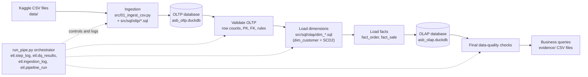
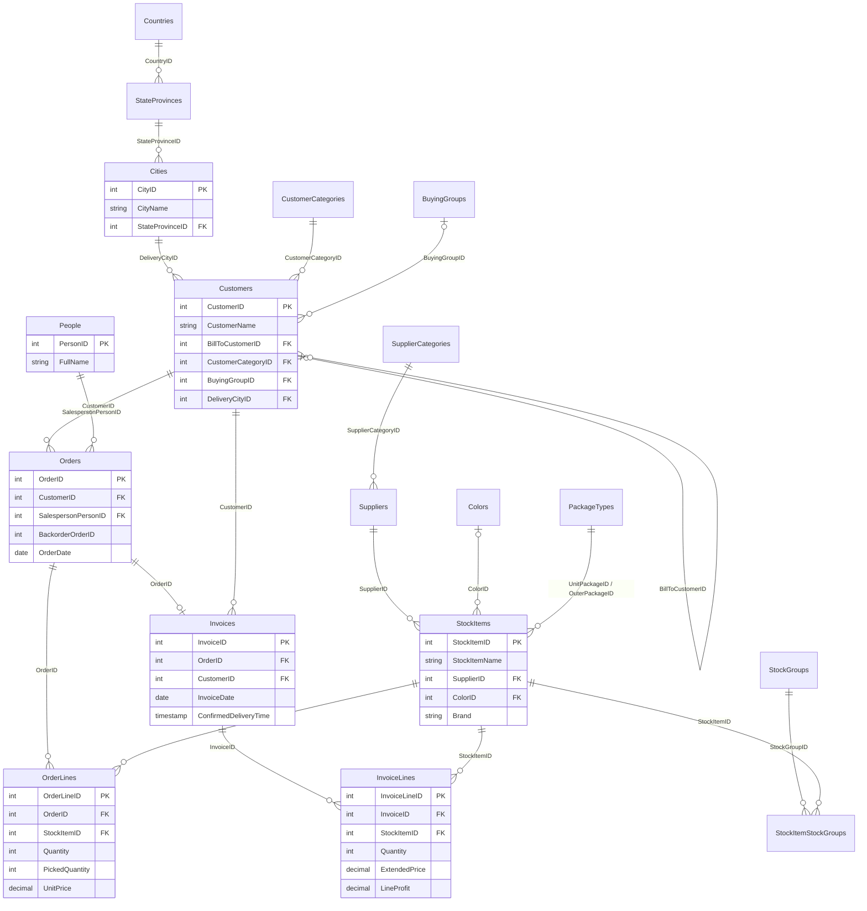
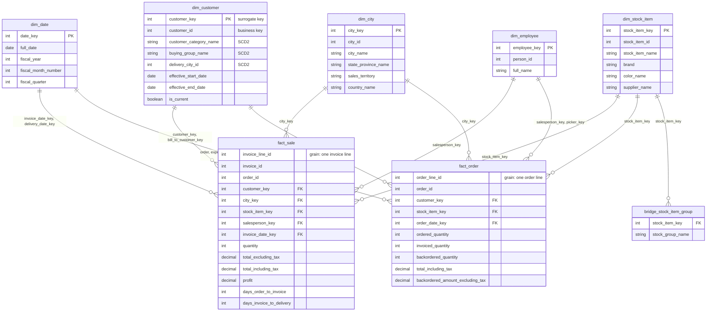

# Wide World Importers: End-to-End Data Engineering Pipeline

**Author:** Brent Nicole C. Cardano | **Course:** IT2222 | **Stack:** Python 3.11+, DuckDB 1.5.6, plain SQL

## 1. Solution overview

The pipeline moves data from raw CSV files to an analytics-ready star schema:

```
Raw CSV files -> OLTP database (asb_oltp.duckdb) -> OLAP staging -> dimensions and facts (asb_olap.duckdb)
```

- **Ingestion** uses the course boilerplate (`src/01_ingest_csv.py` plus the SQL scripts in `src/sql/oltp/`), which loads every CSV into a DuckDB OLTP database.
- **Transformation** is plain SQL (`src/sql/olap/`). It reads **only from the OLTP database**, never from the CSV files.
- **Orchestration** is one Python script, `run_pipe.py`, which runs nine steps in dependency order and logs every step, row count and data-quality result to `etl.*` tables in `asb_olap.duckdb`.
- **SCD Type 2** is implemented on `dim_customer` and demonstrated with two loads (a second input batch is processed through the pipeline, never edited by hand).

## 2. Technology stack and prerequisites

| Item | Choice |
| --- | --- |
| Database | DuckDB 1.5.6 (two files: `asb_oltp.duckdb`, `asb_olap.duckdb`) |
| Language | Python 3.11+ (orchestration), SQL (all transformations) |
| Packages | `duckdb`, `kagglehub`, `tqdm` (see `requirements.txt`) |
| Orchestration | `run_pipe.py` (Python script, one entry point) |

## 3. Setup

1. Open a terminal in the project folder (`03_cs_data_engineering_guide`).
2. Create and activate a virtual environment, then install packages:
   ```
   python -m venv env
   env\Scripts\activate          (Mac/Linux: source env/bin/activate)
   pip install -r requirements.txt
   ```
3. **Raw files:** download the Kaggle dataset and place all CSV files **directly inside `data/`** (no subfolders). Either run `python src/00_download_csv.py` (needs Kaggle access) or unzip the download manually. The raw files are never modified.

## 4. How to run (one entry point)

```
python run_pipe.py                 # load 1: initial build
python src/03_make_batch2.py       # creates the second input batch (data/batch2/)
python run_pipe.py --load 2        # load 2: SCD Type 2 changes flow through the pipeline
python run_pipe.py --load 2        # run again: no changes (idempotency proof)
```

Outputs: `asb_oltp.duckdb`, `asb_olap.duckdb`, a log per run in `logs/`, and evidence per run in `evidence/<run_id>/` (step log, ingestion row counts, data-quality results, table counts and the CSV result of every business query).

### Pipeline steps (same order as the case study)

| # | Step | What happens |
| --- | --- | --- |
| 1 | Validate source files | Every CSV exists, is not empty, and has the columns the SQL scripts need |
| 2 | Prepare OLTP database | Schemas and etl logging tables are created |
| 3 | Ingest CSV into OLTP | Boilerplate script loads the tables. Row counts (file vs table) are logged |
| 4 | Validate OLTP load | Row counts, primary keys, foreign keys, business rules |
| 5 | Prepare OLAP and staging | Load 1 resets the SCD dimension. Staging tables are built inside `dim_customer.sql` |
| 6 | Load dimensions | `dim_date`, `dim_city`, `dim_employee`, `dim_stock_item`, `bridge_stock_item_group`, `dim_customer` (SCD2) |
| 7 | Load facts | `fact_order`, `fact_sale` (only after all dimensions succeeded) |
| 8 | Final data-quality checks | 41 checks (37 pass, 4 informational), including SCD and re-run checks |
| 9 | Record pipeline result | Business queries exported, result stored in `etl.pipeline_run` |

## 5. Diagrams

### 5.1 Pipeline architecture



### 5.2 OLTP entity-relationship diagram (tables used by the OLAP layer)

The boilerplate load creates the tables from the CSV files without declared constraints, so these relationships are **logical**. They are verified by the pipeline's primary-key and foreign-key checks in step 4.



### 5.3 OLAP star schema



## 6. Source-to-target mapping

The boilerplate loads each `Schema.Table.csv` into `schema.table` (snake_case) in `asb_oltp.duckdb`.

| Target table | OLTP source tables | Notes |
| --- | --- | --- |
| `dim_date` | generated calendar (2012-2030) | Fiscal year starts 1 November and is named after the year it ends in |
| `dim_city` | `application.cities`, `state_provinces`, `countries` | City, state or province, sales territory, country, region, coordinates |
| `dim_customer` | `sales.customers`, `customer_categories`, `buying_groups`, `application.people`, `delivery_methods`, `cities`, `state_provinces` | SCD Type 2 |
| `dim_employee` | `application.people` | Only people who are employees or salespeople |
| `dim_stock_item` | `warehouse.stock_items`, `colors`, `package_types`, `purchasing.suppliers` | Brand, color and size are mostly missing in the source and become `N/A` |
| `bridge_stock_item_group` | `warehouse.stock_item_stock_groups`, `stock_groups` | Product categories (many-to-many) |
| `fact_order` | `sales.order_lines`, `sales.orders`, `sales.invoice_lines`, `sales.invoices` | Invoice lines are used for invoiced quantity |
| `fact_sale` | `sales.invoice_lines`, `sales.invoices`, `sales.orders` | Orders are used for days to invoice |

## 7. Fact-table grain

| Fact | Grain | Key measures |
| --- | --- | --- |
| `fact_order` | **One row per customer order line** (`sales.order_lines`) | `ordered_quantity`, `picked_quantity`, `backordered_quantity`, `invoiced_quantity`, `unit_price`, `tax_rate`, `tax_amount`, `total_excluding_tax`, `total_including_tax`, `backordered_amount_excluding_tax`, `days_order_to_invoice` |
| `fact_sale` | **One row per customer invoice line** (`sales.invoice_lines`) | `quantity`, `unit_price`, `tax_rate`, `tax_amount`, `total_excluding_tax`, `total_including_tax`, `profit` (from `LineProfit`), `days_order_to_invoice`, `days_invoice_to_delivery` |

**Unknown or unmatched dimension values:** every dimension has an *Unknown* member with key `-1`. A fact row whose dimension value is missing or unmatched points to `-1`, so no fact row is dropped. The final checks require the **required** keys (customer, city, stock item, salesperson, transaction date) to have zero unknowns. Optional keys (picker, picked date, invoice date on an uninvoiced order, delivery date on an undelivered invoice) are legitimately unknown and are reported as INFO.

## 8. Explanation of the dimensional model

- **Star schema.** Two fact tables share conformed dimensions. Each fact row holds surrogate keys to the dimensions plus additive measures.
- **Surrogate keys.** Dimensions get surrogate keys (`city_key`, `customer_key`, ...). Business keys (`city_id`, `customer_id`, ...) are kept for traceability. Type 1 dimensions are rebuilt in full each run with `ROW_NUMBER()` ordered by the business key, so the same input always gives the same keys.
- **Role-playing dates.** `dim_date` is used several times (order, expected delivery, picked, invoice and delivery dates).
- **Delivery city.** The fact `city_key` comes from the **delivery city of the customer version valid on the transaction date**, so a customer who moves is reported under the right city at the right time.
- **Product categories** use a bridge table because an item can belong to several stock groups. Sales by category therefore add up to more than total sales (an item counts once per group).
- **Load order.** All dimensions are loaded first. Facts are loaded only after every dimension succeeded.
- **Cleaning.** Cleaning happens in SQL macros (`src/sql/macros.sql`): the text `NULL` and empty strings become nulls, dd/mm/yyyy dates and 7-digit timestamps are parsed, and decimal commas are converted. Bad values become NULL instead of failing the load.

## 9. SCD approach

**`dim_customer` uses SCD Type 2** with: surrogate key `customer_key`, business key `customer_id`, `effective_start_date`, `effective_end_date`, `is_current`, and a hash of the tracked attributes (`scd_hash`).

| Attribute | Type | Why |
| --- | --- | --- |
| `customer_category_name`, `buying_group_name`, `delivery_city_id` (and its city and state names) | **Type 2** | These change how revenue should be grouped. Past sales must stay under the category, group and city valid when they happened |
| Customer name, bill-to name, primary contact, delivery method, credit limit, payment days, discount, credit hold, phone, website, address | **Type 1** | Corrections or minor updates. History adds no analytic value, so the value is overwritten on every version |
| `dim_city`, `dim_employee`, `dim_stock_item` | **Type 1** | Reference data. The assignment only requires Type 2 on one dimension |

**How the two-load demonstration works**

1. **Load 1** loads the original customers. Every customer gets one version starting `1900-01-01` and ending `9999-12-31`.
2. `src/03_make_batch2.py` creates a second customer extract (`data/batch2/Sales.Customers.csv`) with 14 changes: 6 category, 3 buying group, 3 delivery city (Type 2), and 2 phone-only (Type 1). Business keys never change. Only customers with orders both before and after the change date are chosen.
3. **Load 2** loads the new extract into the OLTP table, then the SCD script (`dim_customer.sql`):
   - builds a staging table of the current OLTP customers with a hash of the Type 2 attributes,
   - detects customers whose current version has a different hash,
   - overwrites the Type 1 attributes on all versions,
   - **closes** the old version with `effective_end_date = change date - 1 day` and `is_current = false`,
   - **inserts** a new version with a new surrogate key, start date = change date (`2016-01-01`), end date `9999-12-31`, `is_current = true`.
4. Facts are rebuilt from OLTP each run and join to the customer version where `transaction_date BETWEEN effective_start_date AND effective_end_date`.
5. **Results:** `dim_customer` goes from 663 customer versions to 675 (12 new versions, 663 current). The 2 phone-only changes create no new version. Running load 2 again changes nothing.

## 10. Data-quality checks and failure behavior

All results are stored in `etl.dq_results` and exported to `evidence/<run_id>/dq_results.csv`.

- **OLTP (step 4):** source file rows equal table rows; primary keys not null and unique; foreign keys valid (including customer to bill-to customer); positive quantities, non-negative prices, valid and sensibly ordered dates, `ExtendedPrice = Quantity x UnitPrice + TaxAmount`.
- **OLAP (step 8):** surrogate and business keys unique; **one current SCD row per customer; no overlapping or gapped date ranges; end date not before start date**; every fact row's customer version is valid on its transaction date; fact row counts and totals (sales, profit, quantity) equal OLTP; fact grain unique; required keys resolve; **re-running the same load gives identical row counts**.
- **Behavior chosen:** a failed **critical** check stops the pipeline with a clear message, marks the step and run as FAILED in the `etl` tables, and the later steps do not run. **Warnings** (business-rule violations) are recorded and reported but do not stop the run, so the offending rows stay visible for investigation. Rows are not deleted or quarantined, because the OLTP data is kept as received and unmatched dimension values are mapped to the Unknown member instead.

## 11. Business questions

The 10 business questions are answered by `src/sql/queries/` (16 files, because Q2, Q3, Q4, Q5 and Q8 have two or three parts). They run automatically in step 9. Results are saved in `evidence/<run_id>/queries/`.

| Question | File(s) |
| --- | --- |
| 1. Sales, quantity, profit by month and fiscal year | `q01_...` |
| 2. Top products and product categories | `q02a_...`, `q02b_...` |
| 3. Top customers and customer categories | `q03a_...`, `q03b_...` |
| 4. Sales and profit by city, state, territory | `q04a_...`, `q04b_...`, `q04c_...` |
| 5. Salespeople and highest-value orders | `q05a_...`, `q05b_...` |
| 6. Proportion of ordered quantity later invoiced | `q06_...` |
| 7. Average days from order to invoice | `q07_...` |
| 8. Backordered orders and business impact | `q08a_...`, `q08b_...` |
| 9. How tracked customer attributes changed | `q09_...` |
| 10. Correct historical attributes before and after an SCD change | `q10_...` |

## 12. Evidence of execution

Stored in the repository under `evidence/` and `logs/`:

- **CSV to OLTP ingestion and row counts:** `ingestion_log.csv` (file rows vs table rows per table) in each run folder
- **OLTP to OLAP transformation and row counts:** `table_counts.csv`
- **Data-quality results:** `dq_results.csv`
- **SCD Type 2 across two loads:** the load 1 and load 2 run folders, plus `q09` and `q10` query results
- **Orchestrated workflow completion:** `step_log.csv`, `pipeline_run.csv` and the log files in `logs/`
- **Business query results:** `evidence/<run_id>/queries/*.csv`

## 13. Known assumptions and limitations

- **OLTP layer is the course boilerplate.** Tables are created from the CSV files with types inferred by DuckDB and **no declared primary or foreign keys**. Keys, relationships and data types are enforced through the pipeline's validation checks and the SQL cleaning macros instead.
- **Source quirks.** `IsUndersupplyBackordered` is `1` for every order in this dataset, so it cannot identify backorders. A **backordered line** is defined as picked quantity below ordered quantity (3,147 lines in 3,085 orders). Those lines are never invoiced. Brand, color and size are missing for most stock items and show as `N/A`. People has only name fields, so `dim_employee` is small.
- **Invoiced quantity** is matched through order and stock item, which is unique in this dataset.
- **SCD dates are simulated.** The CSV files are a single snapshot, so the change date for load 2 is a parameter (default `2016-01-01`). The first version of each customer starts at `1900-01-01`.
- **Load 1 resets the OLAP customer history** (initial build). Load 2 is incremental.
- **Product category totals double count** items that belong to several groups.
- **Only the sales scope** is built. Purchasing, inventory and the other optional facts are not.
- **Full rebuild.** Facts and Type 1 dimensions are rebuilt from OLTP on every run. This is simple and safe for this data size, but see question 5 below.

## 14. Solution questions

**1. Why did you choose your database, ingestion, transformation, and orchestration tools?**
DuckDB runs in-process from a single file, so there is no server, Docker setup or credential to manage, and the whole pipeline is reproducible on any laptop with `pip install`. It reads CSV files quickly and runs analytic SQL (window functions, joins over 230k rows) in seconds. The course boilerplate already used it for ingestion, so I kept that layer and focused on the warehouse. Transformations are plain SQL files because the work is joins, cleaning and reshaping, which SQL expresses clearly and which can be reviewed and tested without extra frameworks. Orchestration is a single Python script (`run_pipe.py`) because the workflow is a linear nine-step dependency chain. It gives one documented command, explicit step ordering, logging and fail-fast behavior without the operational weight of Airflow or Dagster.

**2. How did you translate the normalized OLTP structure into a dimensional model, and what is the grain of each fact table?**
Normalized lookup tables were joined into descriptive dimensions: cities, state provinces and countries became `dim_city`; customers with their category, buying group, contact and delivery city became `dim_customer`; stock items with color, packages and supplier became `dim_stock_item`; people became `dim_employee`; and a generated calendar became `dim_date`. The transactional header and line tables were flattened into facts at the **line** level: `fact_order` has one row per customer order line (orders joined to order lines) and `fact_sale` has one row per customer invoice line (invoices joined to invoice lines). Header attributes such as customer, salesperson and dates were pushed down to each line as surrogate keys, and measures such as extended amounts, tax, profit and days-to-invoice were derived.

**3. Which dimension and attributes use SCD Type 2, which use SCD Type 1, and why?**
`dim_customer` uses Type 2 for customer category, buying group and delivery city, because these define how revenue is grouped and a customer's past sales must stay attached to the values that were true at the time. All other customer attributes (name, contact, credit limit, phone, address and similar) use Type 1, because they are corrections or minor updates where history adds no analytic value. `dim_city`, `dim_employee` and `dim_stock_item` are Type 1 reference data and are rebuilt on each run. Section 9 shows the two-load demonstration.

**4. How does your pipeline prevent duplicates and produce consistent results when the same input is processed more than once?**
The OLTP tables are fully replaced on each ingestion (`CREATE OR REPLACE TABLE`). Type 1 dimensions and both facts are rebuilt from OLTP with `CREATE OR REPLACE TABLE`, and surrogate keys come from `ROW_NUMBER()` ordered by the business key, so identical input gives identical output with no appended duplicates. The Type 2 dimension is incremental, but it only inserts a new version when the hash of the tracked attributes differs from the current version (or the customer is new), so reprocessing the same batch changes nothing. The pipeline proves this: each run compares its table row counts with the previous successful run of the same load, and the check `rerun_row_counts_stable` must show zero differences. Further checks require one current row per customer and no overlapping date ranges.

**5. What would you change if the source produced millions of records per day and the business required hourly warehouse updates?**
I would replace full rebuilds with **incremental loads**. The source would deliver only new and changed rows (CDC or a high-water mark on a modified timestamp), landed in append-only, partitioned raw tables with a batch ID, and facts would be merged by their business key so retries stay idempotent. Dimension lookups would use the current and historical SCD versions only for the new rows. The SCD2 logic would stay hash-based but run on the changed customers only. I would run the pipeline on a scheduler with retries, alerting and backfill support (Airflow or Dagster), run the data-quality checks per batch with metrics and failure thresholds, and handle late-arriving facts and dimensions with an inferred-member pattern. At that volume I would also move from a single-file embedded database to a scalable warehouse or lakehouse (for example PostgreSQL with partitioning and indexes at the smaller end, or a columnar cloud warehouse such as Snowflake or BigQuery, or Parquet tables with a query engine), partition fact tables by date, and add monitoring of load latency and freshness.

## 15. Sources

- Dataset: Kaggle, *Wide World Importers* CSV dataset (`pauloviniciusornelas/wwimporters`), https://www.kaggle.com/datasets/pauloviniciusornelas/wwimporters
- Schema documentation: Microsoft Learn, *Wide World Importers sample databases* (OLTP and DW database catalogs), https://learn.microsoft.com/en-us/sql/samples/wide-world-importers-what-is?view=sql-server-ver15
- Course boilerplate: Analytics Solutions Bootcamp, Module 3 data engineering guide
